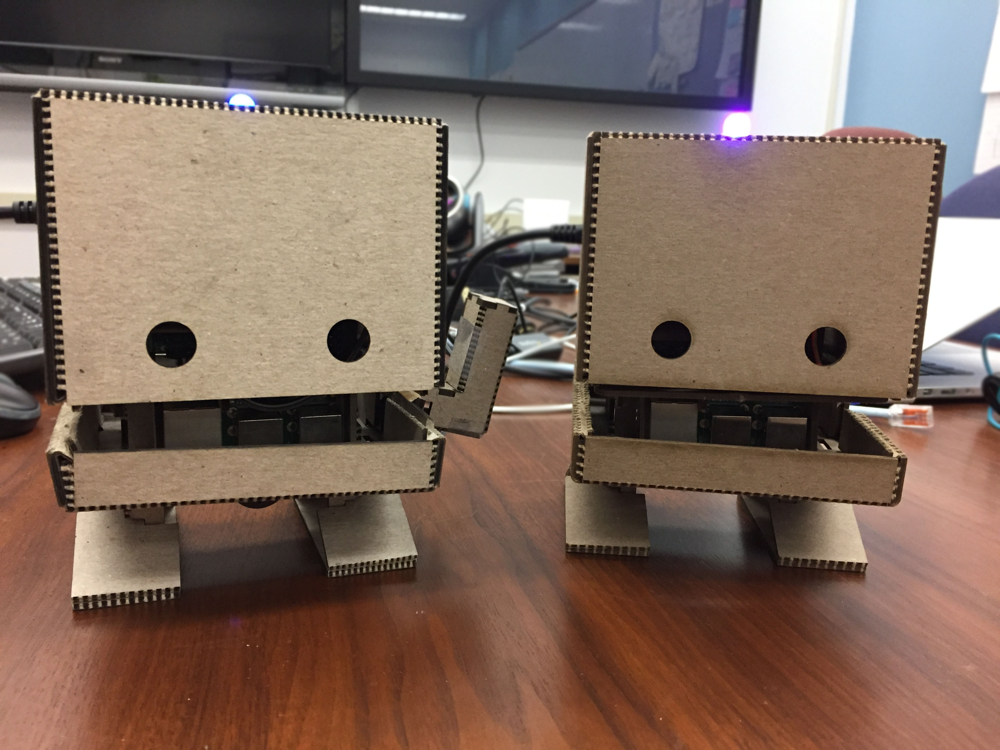
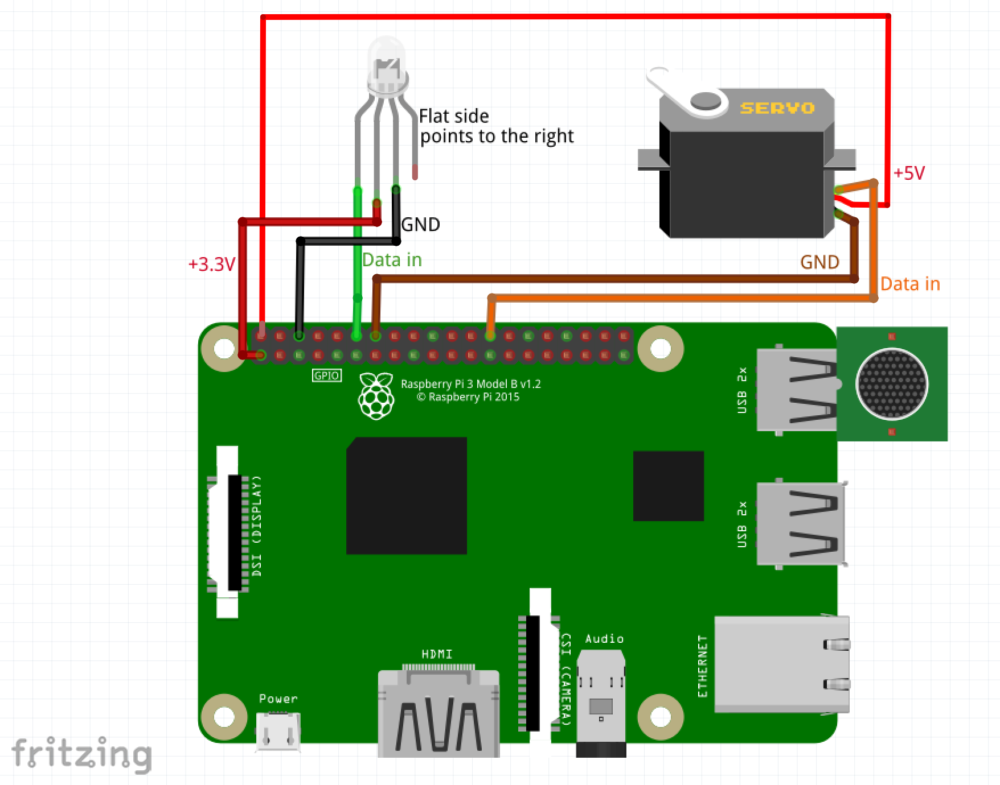

# IBM TJBot


[Maker Kits](http://ibm.biz/mytjbot) are a collection of DIY open source templates to build things with IBM AI services in a fun and easy way. [IBM TJBot](http://ibm.biz/mytjbot) is the first maker kit in the collection. You can 3D print or laser cut the robot body, then use one of our [recipes](recipes) to bring him to life!

In addition, you can unleash your own creativity and create new recipes that bring TJBot to life using any of the available IBM AI services!

**TJBot only works with a Raspberry Pi.**

# Build TJBot
You can make your own TJBot in a number of ways.

- **3d Print or Laser Cut**. If you have access to a 3D printer or laser cutter, you can print/cut TJBot yourself. Begin by downloading the [design files](https://ibmtjbot.github.io/#gettj) and firing up your printer/cutter.
- **TJBot Full Kit**. You can order a full TJBot kit with the laser cut cardboard and all the electronics from [Sparkfun](https://www.sparkfun.com/products/14123), [Adafruit](https://www.adafruit.com/product/3462), or [Robotkingdom](http://shop.robotkingdom.com.tw/raspberry-pi/tjbot01.html).
- **TJBot Cardboard Kit**. You can purchase the TJBot laser cut cardboard from [Texas Laser Creations](http://texlaser.com).

## Electronics
There are a number of components you can add to TJBot to bring him to life. Not all of these are required for all recipes.

- [Raspberry Pi 3 + SD card preloaded with NOOBS](https://www.amazon.com/Vilros-Raspberry-Complete-Starter-Clear/dp/B01CUMNIV8/ref=sr_1_15?crid=35701RIYP4VK2&keywords=raspberry+pi+3+noobs+sd+card&qid=1569425114&sprefix=Raspberry+Pi+3+Loo%2Caps%2C131&sr=8-15). **This is a required component to make TJBot work!** 🤖
- [NeoPixel RGB LED (8mm)](https://www.adafruit.com/product/1734). Note that if you are using other kinds of LEDs, you may need to add a resistor; this LED doesn’t require one.
- [Female-to-female jumper wires](https://www.amazon.com/dp/B00KOL5BCC/). TJBot will only need 3 of these wires, so you’ll have extra.
- [Female-to-male jumper wires](https://www.amazon.com/dp/B00PBZMN7C/). TJBot will only need 3 of these wires, so you’ll have extra.
- [USB Microphone](https://www.amazon.com/gp/product/B00IR8R7WQ/). Other brands of USB microphones should also work.
- Mini Bluetooth Speaker. Any small speaker with either a 3.5mm audio jack or Bluetooth will work. Note that if you are using the 3.5mm audio jack, you may wish to add a [USB Audio Adapter](https://www.adafruit.com/product/1475) to avoid audio interference with the LED.
- [Servo Motor](https://www.amazon.com/RioRand-micro-Helicopter-Airplane-Controls/dp/B00JJZXRR0/). Note that the red (middle) wire is 5v, the brown wire is ground, and the orange wire is data.
- [Raspberry Pi Camera](https://www.amazon.com/dp/B01ER2SKFS/). Either the 5MP or 8MP camera will work.

## Assembly
Once you have obtained your TJBot, please refer to [the assembly instructions](http://www.instructables.com/id/Build-TJ-Bot-Out-of-Cardboard/) to put it all together.

For reference, here is the wiring diagram to hook up the LED and servo to your Raspberry Pi.



> 💡 Be careful when connecting the LED! If it is connected the wrong way, you may end up burning it out. The LED has a flat notch on one side; use this to orient the LED and figure out which pin is which.

> For the servo, note that the red (middle) wire is 5v, the brown wire is ground, and the orange wire is data.

# Bring TJBot to Life
First, make sure you have configured your Raspberry Pi for TJBot.
Just run that command to download and install TJBot:

```
curl -sL http://ibm.biz/tjbot-bootstrap | sudo sh -
```

[Recipes](recipes) are step-by-step instructions to bring your TJBot to life with IBM Watson and AI services

We have provided three initial [recipes](recipes) for you:

- Use Your Voice to Control a Light with Watson [[instructions](http://www.instructables.com/id/Use-Your-Voice-to-Control-a-Light-With-Watson/)] [[github](https://github.com/ibmtjbot/tjbot/tree/master/recipes/speech_to_text)]
- Make Your Robot Respond to Emotions Using Watson [[instructions](http://www.instructables.com/id/Make-Your-Robot-Respond-to-Emotions-Using-Watson/)] [[github](https://github.com/ibmtjbot/tjbot/tree/master/recipes/sentiment_analysis)]
- Build a Talking Robot with Watson [[instructions](http://www.instructables.com/id/Build-a-Talking-Robot-With-Watson-and-Raspberry-Pi/)] [[github](https://github.com/ibmtjbot/tjbot/tree/master/recipes/conversation)]

After checking out our sample recipes, we encourage you to take a look at [featured recipes](featured) created by members of our community.

# Contribute to TJBot
TJBot is an open source project designed to make it fun and easy to interact with [Watson](https://www.ibm.com/watson/products-services/). We’d love to see what you can make with him!

If you would like your own recipe included in our [featured recipe](featured) list, please [open an issue](../../issues) with a link to your repository and a demo video.

# About TJBot
[TJBot](http://ibm.biz/mytjbot) was affectionately named after Thomas J. Watson, the first Chairman and CEO of IBM. TJBot was created by [Maryam Ashoori](https://github.com/maryamashoori) at IBM Research as an experiment to find the best practices in the design and implementation of cognitive objects. He was born on November 9, 2016 via [this blog post](https://www.ibm.com/blogs/research/2016/11/calling-makers-meet-tj-bot/).

# License
This project uses the [Apache License Version 2.0](LICENSE) software license.
