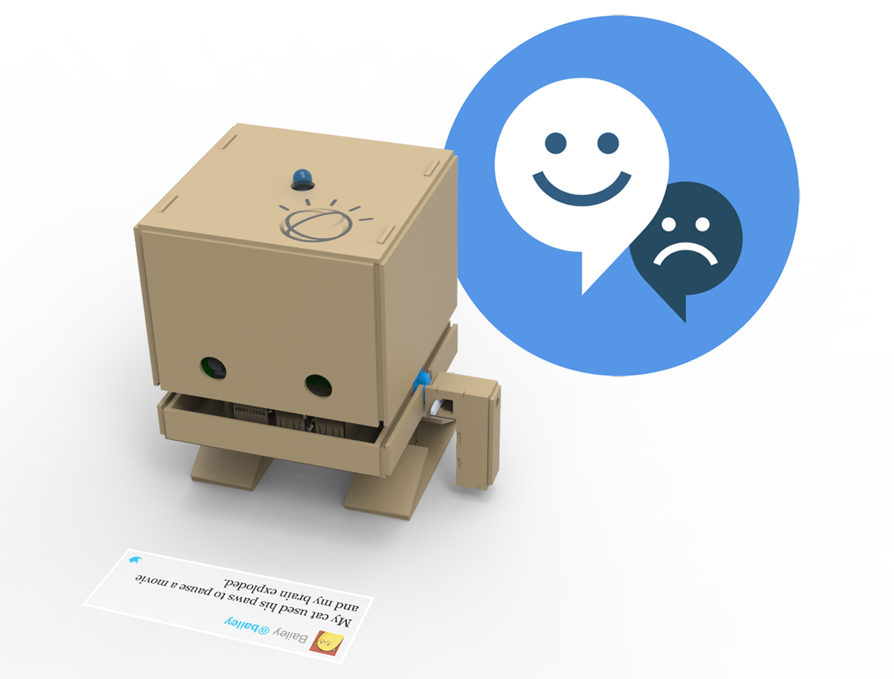
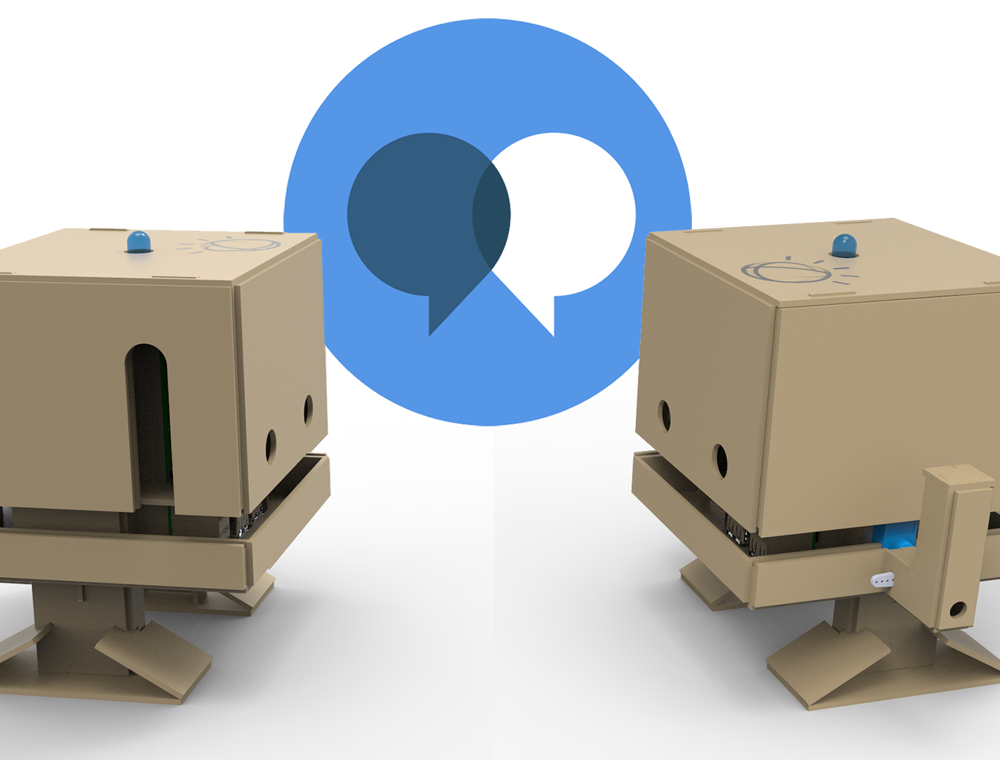

# Recipes
Recipes are step by step instructions to help you connect your TJBot to [Watson](https://www.ibm.com/watson/products-services/).

The recipes are designed to be run on a Raspberry Pi. You can either run one of our sample recipes below, or create your own recipe that brings your ideas to life using [Watson](https://www.ibm.com/watson/products-services/)!

### [Speech to Text](speech_to_text)
> Use your voice to control TJBot's LED with Watson [[instructables](http://www.instructables.com/id/Use-Your-Voice-to-Control-a-Light-With-Watson/)]

This receipe lets you control the [8mm NeoPixel RGB led](https://www.adafruit.com/products/1734) using voice commands. It uses the [Watson Speech to Text](https://www.ibm.com/watson/services/speech-to-text/) API.

### [Sentiment Analysis](sentiment_analysis)
> Make TJBot respond to emotions with Watson [[instructables](http://www.instructables.com/id/Make-Your-Robot-Respond-to-Emotions-Using-Watson/)]

This recipe shines TJBot's [8mm NeoPixel RGB LED](https://www.adafruit.com/products/1734) different colors based on the emotions present in Twitter for a given keyword. It uses [Watson Tone Analyzer](https://www.ibm.com/watson/services/tone-analyzer/) and the [Twitter API](https://dev.twitter.com/overview/api).

### [Conversation](conversation)
> Build a talking robot with Watson [[instructables](http://www.instructables.com/id/Build-a-Talking-Robot-With-Watson-and-Raspberry-Pi/)]

This recipe demonstrates how to use the [Watson Speech to Text](https://www.ibm.com/watson/services/speech-to-text/), [Watson Text to Speech](https://www.ibm.com/watson/services/text-to-speech/), and [Watson Assistant](https://www.ibm.com/watson/services/conversation/) services to build a talking chatbot.

## Featured Recipes
Check out the [featured TJBot recipes](../featured) created by members of our community.

## Contributing Your Own Recipes
TJBot is an open source project designed to make it fun and easy to interact with [Watson](https://www.ibm.com/watson/products-services/).

If you would like your own recipe included in our [featured recipe](../featured) list, please [open an issue](../../../issues) and provide a link to your repository and a demo video.

For guidelines on contributing to the TJBot project, please refer to the [contribution guide](../CONTRIBUTING.md).

We can't wait to see what you make with TJBot!
