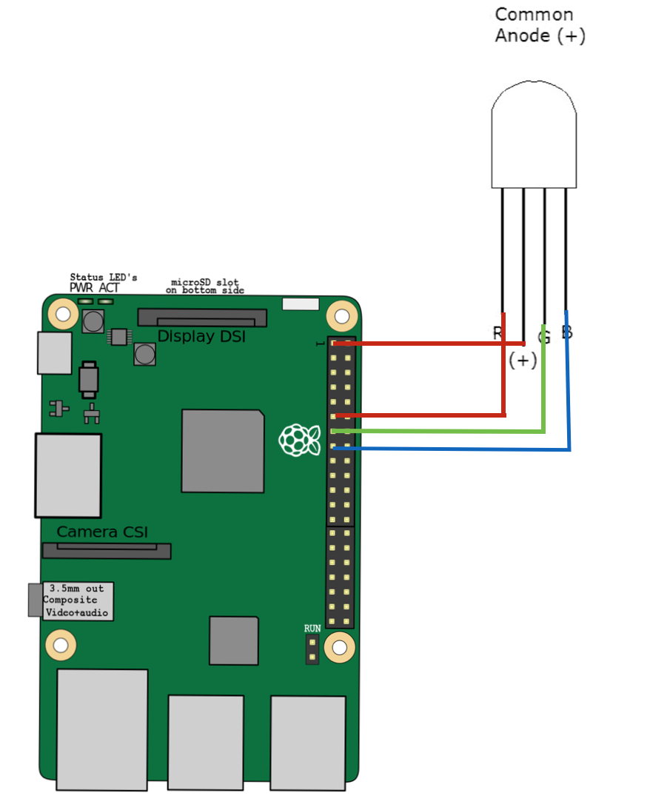

# Speech to Text
> Use your voice to control a LED with [Watson](https://www.ibm.com/watson/developercloud/speech-to-text.html)

This module provides a Node.js code to control a [5mm common anode JKD RGB led](https://www.sparkfun.com/products/10820) using voice commands. For example, you may say "Turn the light green" to change the color of the LED to green.

**This will only run on the Raspberry Pi.**

##How It Works
- Listens for the voice commands (e.g "turn the light green")
- Sends audio from the microphone to the [Watson Speech to Text Service - STT](https://www.ibm.com/watson/developercloud/speech-to-text.html) to convert to text
- Parses the text to identify the given voice command
- Switches the LED on/off depending on the given command

##Hardware

You will need a Raspberry Pi 3, a microphone, a a [5mm common anode JKD RGB led](https://www.sparkfun.com/products/10820), 4 Female/female jumper wires, and [the TJBot cardboard](http://ibm.biz/mytjbot). Wire diagram is provided in next section

##Build
> We recommend starting with [our step by step instructions](http://www.instructables.com/id/Use-Your-Voice-to-Control-a-Light-With-Watson/) to build this recipe.

Get the sample code and go to the application folder.  Please see this [instruction on how to clone](https://help.github.com/articles/cloning-a-repository/) a repository.

    cd recipes/speech_to_text

Install ALSA tools (required for recording audio on Raspberry Pi)

    sudo apt-get install alsa-base alsa-utils

Install Dependencies

    npm install

Add your Bluemix Speech to text service credentials

    edit config.js
    enter your watson stt username, password and version.

##Testing the LED
The wiring diagram:

##Running

Start the application

    sudo node stt.js   

> Note the `sudo` command. Root user access is required to control the NeoPixel LEDs.

Now talk to your microphone to change the color of the LED.
Say  "Turn the light blue" to change the light to blue. You can try other colors: yellow, green, orange, purple, magenta, red, blue, aqua, white). You can either say "Turn the light on" or "Turn the light off"!

##Customization

Try implementing your own TJBot party and share it with us #TJBot!

Once ready to move on, try the next recipe to [make TJBot respond to emotions using Watson](../sentiment_analysis).

##Dependencies

- [Watson Speech to Text](https://www.ibm.com/watson/developercloud/speech-to-text.html)
- mic npm package for reading audio input
- [rpio](https://www.npmjs.com/package/rpio) npm package to work with Raspberry pi pins LED.

## Contributing
See [CONTRIBUTING.md](../../CONTRIBUTING.md).
